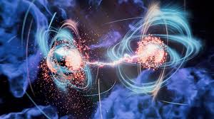
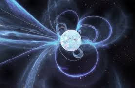
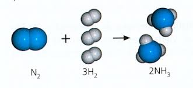

# Entropía: Evolución histórica, Definiciones y Segunda Ley de la Termodinámica
*Autores:* 
* Juan Sebastián Camargo Acero
* Franky Adrian Montenegro Guevara
* Juan Sebastián Trejos Ocampo

*Curso:* Principios de Química
## Introducción
La entropía es, quizás, uno de los conceptos más incomprendidos de la química física. A menudo se despacha simplemente como "desorden", 
pero esa es una simplificación que oculta su verdadera naturaleza. En este documento, se analiza cómo el concepto mutó de ser una propiedad térmica macroscópica a una 
ley estadística y finalmente, a una medida de información.

---

## 1. Origen del concepto: Rudolf Clausius y la Calidad de la Energía (1865)
Clausius no llegó a la entropía estudiando átomos (en esa época ni siquiera se aceptaba del todo su existencia), sino analizando el rendimiento de las máquinas de vapor. Se dio cuenta de que el calor no solo se conserva, sino que se "degrada".

* *El Concepto de Irreversibilidad:* Clausius observó que los procesos naturales tienen una dirección única. El calor fluye del cuerpo caliente al frío, pero nunca al revés de forma espontánea. La entropía fue su herramienta para medir cuánto de ese calor ya no puede transformarse en trabajo útil.
* *Definición Matemática:* Él estableció que para un proceso reversible, el cambio de entropía ($dS$) es el cociente entre el calor transferido ($dQ_{rev}$) y la temperatura absoluta ($T$):
  $$dS = \frac{dQ_{rev}}{T}$$

> *Ejemplo aplicado*:
> Un ejemplo clásico es el funcionamiento de un refrigerador. Para que un refrigerador esté frío por dentro (ordenado/baja entropía),
>  necesita un motor que trabaje constantemente. Si desconectas el motor, el calor entra y todo se echa a perder (aumenta la entropía).
>  Además, si tocas la parte de atrás de la nevera, está caliente; eso demuestra que para bajar la entropía adentro, tuvimos que aumentarla afuera expulsando calor.

  

---

## Sobre la Dispersión o distribucion de Energía:
 Conceptualmente, la entropía puede entenderse como la *dispersión o distribución de la energía*.
 En un sistema aislado, la energía no desaparece, pero tiende a distribuirse de la manera más amplia posible entre todos los niveles energéticos disponibles.
 Cuando la energía está "concentrada", tiene baja entropía y puede producir trabajo; cuando se "dispersa",
 la entropía aumenta y la energía se vuelve térmicamente inalcanzable.

---
## 2. Aporte de la física estadística: Ludwig Boltzmann y la Probabilidad (1877)
Boltzmann dio el salto más difícil: conectar el mundo que vemos con el mundo de los átomos. Para él, la entropía dejó de ser un flujo de calor y pasó a ser una cuestión de
*estadística pura*.
relacionó la entropía con la probabilidad de que un sistema adopte diferentes configuraciones microscópicas.
Un sistema puede verse igual desde afuera, pero a nivel de partículas puede organizarse de muchas formas distintas. A esas configuraciones Boltzmann las llamó *microestados*.
Por eso propuso su famosa fórmula:

$$S = k_B \ln W$$

  Donde:

*   *S:* Entropía
*   *kB:* Constante de Boltzmann
*   *W:* Número de microestados posibles

> *Ejemplo cotidiano:*
>  Un ejemplo perfecto es abrir una botella de perfume en una esquina del salón.
>  Al principio, todas las moleculas de olor estan ordenadas dentro del frasco (baja entropía). Con el tiempo, se esparcen por todo el cuarto.
>  Según Boltzmann, esto no pasa por una fuerza mágica, sino por probabilidad: hay millones de formas (microestados)
>  de que las moléculas estén esparcidas, pero muy pocas formas de que se queden todas juntas en el frasco. La naturaleza simplemente sigue lo que es más probable.

  

## 3. La Entropía de la Información: Claude Shannon (1948)
Esta es la definición "alternativa" más interesante. Shannon no era químico, trabajaba en telecomunicaciones, pero su matemática resultó ser idéntica a la de Boltzmann.
Casi un siglo después, Shannon demostró que la entropía es también una medida de la *incertidumbre*.
Si un sistema es predecible, tiene baja entropía; si es caótico o desconocido, su entropía es alta.

En su artículo "A Mathematical Theory of Communication", Shannon definió la entropía ($H$) como:

$$H(X) = - \sum_{i=1}^{n} p_i \log_b p_i$$

*Donde:*
* *H(X):* Representa la incertidumbre promedio. Es una medida de cuánto nos "sorprende" el estado de un sistema.
* *pi:* Es la probabilidad de que el sistema se encuentre en un estado específico. En química, esto se traduce a la probabilidad de encontrar una partícula en un microestado determinado.
* *El signo negativo (-):* Es un ajuste matemático necesario. Dado que las probabilidades (pi) son siempre menores a 1, sus logaritmos son negativos; el signo menos asegura que el valor final de la entropía sea un número positivo.

*Fusión del hielo:*
* En el hielo, las moléculas están ordenadas -→ *entropía baja*.
* En el agua líquida, se mueven libremente -→ *entropía alta*.

> *Ejemplo cotidiano* Un ejemplo cotidiano de la entropía de Shannon es el autocompletado de mensajes en un móvil:
> * cuando se empieza una frase común como "¿Qué tal...", la probabilidad de que la siguiente palabra sea "estás" es tan alta que la incertidumbre es mínima
(baja entropía) y el mensaje apenas aporta "informacion nueva" por ser tan predecible; por el contrario, si escribes una palabra totalmente inesperada o aleatoria,
la incertidumbre aumenta (alta entropía) porque el sistema no puede predecir tu intención, demostrando que para Shannon la información es una medida de la sorpresa:
cuanto menos probable es un evento, más información transmite y mayor es su entropía.

  

---

## 4. Importancia Moderna y Síntesis
Hoy entendemos que la entropía es el hilo conductor entre la eficiencia de un motor, la estabilidad de una proteína y la capacidad de
almacenamiento de un disco duro. Incluso en la cosmología moderna, se estudia la entropía de los agujeros negros (fórmula de Hawking-Bekenstein), 
demostrando que la información tiene un peso físico real en el tejido del universo.

> La idea de que la información tiene un papel físico fundamental está muy presente en conceptos como el *principio holográfico*,
> lo cual conecta naturalmente con la segunda parte de nuestro trabajo en grupo.
---
# Perspectivas Avanzadas de la Entropía: Información, Cuántica y Microestados

Esta sección profundiza en las interpretaciones modernas de la entropía, desde su papel en la teoría de la información hasta su relación con la geometría del espacio-tiempo y la naturaleza de los microestados.

---

## 1. La Entropía como Medida de Información (Shannon y Jaynes)
En el contexto de las comunicaciones, la entropía cuantifica la incertidumbre o la cantidad de información necesaria para describir el estado de un sistema. Esta perspectiva, introducida por *Claude Shannon (1948)*, establece un puente directo con la termodinámica.

### Fundamento Matemático
La entropía de Shannon ($H$) se define como:
$$H = - \sum_{i} p_i \log p_i$$

* *Análisis:* Mientras que en termodinámica la entropía mide microestados físicos, en esta teoría se interpreta como la *incertidumbre del mensaje*. Un sistema con mayor entropía es más impredecible y, por lo tanto, requiere más información para ser descrito.
* *Aporte de Jaynes (1957):* Reformuló la mecánica estadística como un problema de inferencia basada en información, unificando ambas visiones.

---

## 2. Entropía de Entrelazamiento Cuántico (von Neumann)
En la mecánica cuántica, la entropía se utiliza para cuantificar el grado de correlación o "enredo" entre subsistemas. Si un sistema está dividido, la entropía de una de sus partes mide qué tan fuertemente están vinculadas entre sí.

  

### La Entropía de von Neumann
Se expresa mediante la matriz densidad ($\rho$):
$$S(\rho) = - \text{Tr}(\rho \ln \rho)$$

* *Interpretación:* Un valor de $S = 0$ indica un "estado puro" (certeza total), mientras que un valor $S > 0$ revela la presencia de correlaciones cuánticas fundamentales.
* *Aplicaciones:* Este enfoque es la piedra angular de la computación cuántica y la teoría de agujeros negros.

---

## 3. El Principio Holográfico y la Dimensionalidad
Una de las fronteras más fascinantes de la física teórica moderna sugiere que la entropía no depende del volumen de una región, sino del área de su frontera.

  

### La Entropía de Hawking-Bekenstein
Para un agujero negro, la entropía máxima se calcula como:
$$S = \frac{k c^3 A}{4 \hbar G}$$

* *Significado Geométrico:* Esta fórmula indica que la información física de un objeto tridimensional puede estar "codificada" en una superficie de dos dimensiones.
* *Origen:* Proviene de la síntesis entre la relatividad general, la mecánica cuántica y la termodinámica.

---

## 4. Definición Detallada de Microestado
Para comprender las fórmulas anteriores, es esencial definir con precisión qué es un *microestado*. Se puede abordar desde tres niveles de complejidad:

### A. Configuración Microscópica Completa
Es la especificación detallada de las variables microscópicas (posiciones y momentos) de todas las partículas del sistema. En la mecánica clásica, esto corresponde a un punto en un espacio de fases de dimensiones $6N$.

### B. Elemento de una Distribución Estadística
Bajo restricciones macroscópicas (como energía o volumen fijo), un microestado es una de las múltiples configuraciones compatibles con dichas restricciones. Su probabilidad de ocurrencia depende del tipo de *ensamble* (microcanónico, canónico o gran canónico).

### C. Unidad Fundamental de Entropía (Boltzmann)
Es la realización individual que contribuye al número total de estados accesibles ($\Omega$), sirviendo como el insumo directo para la ecuación fundamental de Boltzmann:
$$S = k \ln \Omega$$

---
# Segunda Ley de la Termodinámica — Definición, Ecuaciones, Entropía e Interpretación Química

## 1. Definición de la Segunda Ley de la Termodinámica

La Segunda Ley de la Termodinámica establece que:

> **En todo proceso espontáneo, la entropía total del universo aumenta.**

$$
\Delta S_{\text{universo}} > 0
$$

Para procesos reversibles:

$$
\Delta S_{\text{universo}} = 0
$$

Esta ley define la **dirección natural** en la que los procesos ocurren.

---

## 2. Ecuaciones Fundamentales

### Definición de entropía (proceso reversible)

$$
dS = \frac{\delta Q_{\text{rev}}}{T}
$$

Integrando entre dos estados:

$$
\Delta S = \int \frac{\delta Q_{\text{rev}}}{T}
$$

---

###  Desigualdad de Clausius

Para un ciclo termodinámico:

$$
\oint \frac{\delta Q}{T} \le 0
$$

Para procesos irreversibles:

$$
\Delta S \ge \int \frac{\delta Q}{T}
$$

---

###  Balance de entropía del universo

$$
\Delta S_{\text{universo}} =
\Delta S_{\text{sistema}} +
\Delta S_{\text{alrededores}}
$$

---

## 3. Tipos de Entropía

###  Entropía del sistema

Cantidad de estado que depende del calor reversible:

$$
dS = \frac{\delta Q_{\text{rev}}}{T}
$$

---

###  Entropía de los alrededores (entorno)

Si el ambiente está a temperatura constante:

$$
\Delta S_{\text{alrededores}} = \frac{Q}{T_{\text{bath}}}
$$

---

###  Entropía del universo

Determina la espontaneidad:

- Si  
  $$
  \Delta S_{\text{universo}} > 0
  $$  
  el proceso es espontáneo

- Si  
  $$
  \Delta S_{\text{universo}} = 0
  $$  
  es reversible

- Si  
  $$
  \Delta S_{\text{universo}} < 0
  $$  
  el proceso no puede ocurrir espontáneamente

---

## 4. Entropía Estadística (Boltzmann)

Interpretación microscópica:

$$
S = k_{\mathrm{B}} \ln W
$$

- \( W \): número de microestados disponibles  
- \( k_{\mathrm{B}} \): constante de Boltzmann  

A más microestados, más desorden y mayor entropía.

---

# 6. Interpretación Química de la Segunda Ley

La Segunda Ley es fundamental en química para entender espontaneidad, equilibrio y termodinámica molecular.

---

##  6.1 Espontaneidad de Reacciones Químicas

Una reacción química es espontánea cuando:

$$
\Delta S_{\text{universo}} > 0
$$

Ejemplo típico donde la entropía del sistema aumenta:

$$
\text{CaCO}_3(s) \rightarrow \text{CaO}(s) + \text{CO}_2(g)
$$

Aquí aparece un gas ⇒ mayor desorden ⇒ \( \Delta S_{\text{sistema}} > 0 \).

---

##  6.2 Entropía de los alrededores en reacciones

Para una reacción a presión constante:

$$
\Delta S_{\text{alrededores}} = -\frac{\Delta H}{T}
$$

Interpretación:
- Si \( \Delta H < 0 \) (exotérmica), los alrededores ganan entropía.  
- Si \( \Delta H > 0 \) (endotérmica), los alrededores pierden entropía.

Una reacción puede ser espontánea aunque \( \Delta S_{\text{sistema}} < 0 \) si \( -\frac{\Delta H}{T} \) es suficientemente grande.

---

##  6.3 Energía Libre de Gibbs 

Se usa para decidir espontaneidad sin evaluar explícitamente \( \Delta S_{\text{universo}} \):

$$
\Delta G = \Delta H - T \Delta S
$$

Criterio de espontaneidad:

$$
\Delta G < 0
\quad \Longleftrightarrow \quad
\Delta S_{\text{universo}} > 0
$$

Esto es lo que se usa en termodinámica química y bioquímica.

---

##  6.4 Equilibrio químico

En equilibrio:

$$
\Delta G = 0
$$

$$
\Delta S_{\text{universo}} = 0
$$

No hay tendencia neta a reaccionar en ninguna dirección.

---

##  6.5 Entropía microscópica en química

- Más partículas ⇒ más microestados ⇒ mayor entropía  
- Gases tienen más entropía que líquidos  
- Líquidos tienen más entropía que sólidos  
- Mezclas tienen mayor entropía que sustancias puras  

Ejemplo interesante:

$$
\text{N}_2(g) + 3\text{H}_2(g) \rightarrow 2\text{NH}_3(g)
$$

Aunque disminuyen los moles gaseosos (entropía del sistema baja),  
la reacción puede ser espontánea si es fuertemente exotérmica.

  

---

# Bibliografía

- MIT OpenCourseWare – Termodinámica  
- UC San Diego – *Entropy and the Second Law*  
- NIST Chemistry WebBook  
- Stanford Encyclopedia of Philosophy – Boltzmann  
- Atkins & de Paula – *Physical Chemistry*  
- Schroeder – *Thermal Physics*  
- Chang & Goldsby – *Química* (McGraw-Hill)

